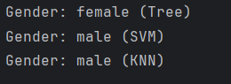

# Part 1: Gender Classifier
## - Project Goal
My first **Data Science project**, Classify gender (Male/Female) based on height, weight, and shoe size using 3 different models.

## - Models Compared
* Decision Tree
* SVM (Support Vector Machine)
* KNN (K-Nearest Neighbors)

## - Observations & Notes
During testing, I observed a "model disagreement" on specific data points (e.g., [170, 70, 39]):
* Decision Tree predicted: **Female**
* SVM predicted: **Male**
* KNN predicted: **Male**

## - Analysis:
This highlights a classic challenge in AI: Data Overlap. With only 3 features and a small dataset of 11 samples, the Decision Tree became too rigid (overfitted to specific thresholds), while SVM and KNN looked at the global distribution. To reach 100% accuracy, we would need:
* A much larger dataset.
* More diverse features (e.g., voice pitch, bone structure).

## - Requirements
* Python 3.13
* Scikit-Learn